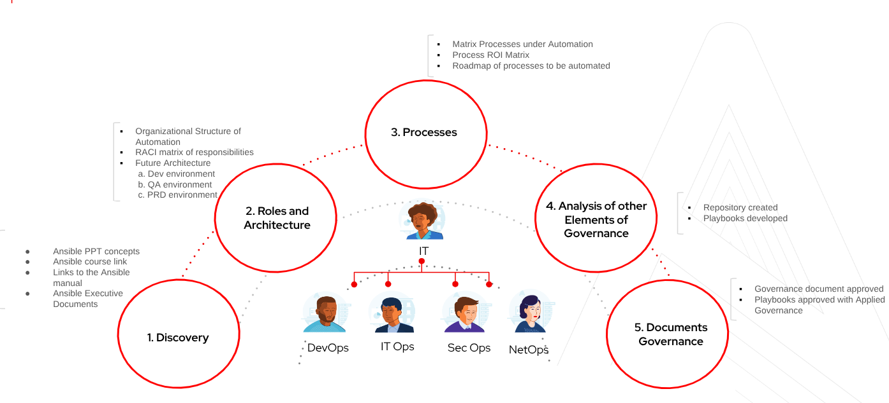

# 2. Modelo de gobierno

## Recorrido de construcción del gobierno

La imagen guía cinco etapas de adopción, con colaboración entre DevOps, IT Ops, SecOps y NetOps. Estas etapas agrupan las decisiones del workshop; el ciclo de vida de cada automatización se detalla en el bloque 5.

| Etapa visual | Trabajo guiado | Bloques del workshop | Evidencia de salida |
| --- | --- | --- | --- |
| 1. Discovery | Identificar problema, consumidor, línea base y riesgo | Fundamentos y ejercicio | Ficha de caso priorizado |
| 2. Roles and Architecture | Asignar owner, suplentes y entornos DEV/QA/PRD | Modelo, roles y AAP | RACI y arquitectura acordados |
| 3. Processes | Inventariar procesos, estimar valor y ordenar pilotos | Ciclo de vida y roadmap | Backlog con prioridad y métrica |
| 4. Analysis of other Elements of Governance | Revisar Git, playbooks, pruebas y controles | Git y controles | PR con evidencia de validación |
| 5. Documents Governance | Acordar políticas y aprobar expediente | Ejercicio y cierre | Modelo aprobado, output aceptado y revisión programada |

**Actividad guiada (10 minutos del bloque de gobierno):** ubicar el caso del equipo en las cinco etapas. Registrar una brecha, una evidencia requerida y un responsable por etapa. Usar esas brechas para el roadmap de 90 días.

## Principios y reglas aplicables
| Principio | Regla | Owner del control |
| --- | --- | --- |
| Seguridad por defecto | Privilegios, destino y entradas limitados desde diseño | Seguridad |
| Ownership claro | Cada caso registra owner de negocio, técnico y operador | Dueño de dominio |
| Versionado | Release enlaza commit, EE por digest y dependencias | SCM |
| Trazabilidad | Ticket, aprobaciones, job ID y output comparten request_id | Operaciones |
| Separación de funciones | El autor no aprueba su propio cambio de riesgo alto | Dueño y Seguridad |
| Reversibilidad | Definir compensación, recuperación y límites antes de ejecutar | Dev y dominio |

## Políticas mínimas
- Identificador de caso: `UC-<DOMINIO>-<NUMERO>`, por ejemplo `UC-NET-001`.
- Recursos: minúsculas, números y guiones, con entorno, servicio y función cuando corresponda. El límite de longitud depende del proveedor.
- Tags obligatorios: `owner`, `domain`, `environment`, `cost_center`, `use_case_id`, `data_classification`.
- `defaults` para valores reemplazables del rol. `group_vars` para entorno o grupo. `host_vars` para excepciones por host. `extra_vars` únicamente para entradas aprobadas. Su precedencia puede sobreescribir controles: validar dentro del playbook y restringir Prompt on launch.
- Secrets mediante AAP Credentials, secret manager o Ansible Vault. Nunca en surveys de texto libre, inventarios planos ni artefactos.
- Límites de destino: inventory separado, limit permitido y credencial por entorno. El mismo nombre de Job Template no demuestra aislamiento.
- Cada release conserva contrato de output, evidencia de pruebas, revisión de seguridad y runbook.

## Clasificación de riesgo
| Nivel | Criterio | Gate |
| --- | --- | --- |
| Bajo | Consulta sin datos sensibles o demo local | Peer review y revisión de seguridad inicial |
| Medio | Cambio reversible en un servicio acotado | Owner de dominio y Seguridad revisan impacto |
| Alto | Producción crítica, identidad, red, destrucción o datos sensibles | Aprobador independiente, change record y plan de recuperación probado |

Seguridad revisa privilegios, secrets y hardening de todo caso nuevo. En releases posteriores define si los controles automáticos y la evidencia previa bastan o si requiere revisión humana. Registrar esa decisión. Un job puede requerir autorización de ejecución aunque el código ya tenga aprobación.

## Gates por etapa
1. Entrada: objetivo, prioridad, owner, alcance y riesgo aceptados.
2. Diseño: contratos, threat model y recuperación revisados.
3. Código: checks y revisiones del PR completos.
4. Release: commit conocido y dependencias congeladas.
5. Promoción: pruebas no productivas y aceptación de negocio.
6. Ejecución: ticket, ventana, destinatario y aprobación según riesgo.
7. Cierre: resultado validado, output entregado y aceptación registrada.

## Excepciones y emergencias
Una excepción contiene política afectada, justificación, controles compensatorios, aprobador y caducidad. Una urgencia permite un flujo abreviado aprobado por el responsable de incidente, con evidencia posterior y revisión en el siguiente día hábil. No convierte una credencial compartida permanente en un control aceptable. Los accesos de emergencia caducan y se auditan.

## Catálogo y revisión
El catálogo lista dominio, repositorio, release, Job Template, owner, riesgo, última ejecución, última revisión y fecha de retiro. Revisar trimestralmente permisos, credenciales, dependencias y casos sin consumo. Retirar schedules, templates y accesos antes de archivar código.

## Actividad y salida
Clasificar el caso del equipo y registrar sus gates. El owner y Seguridad validan la clasificación y el tiempo de revisión.
