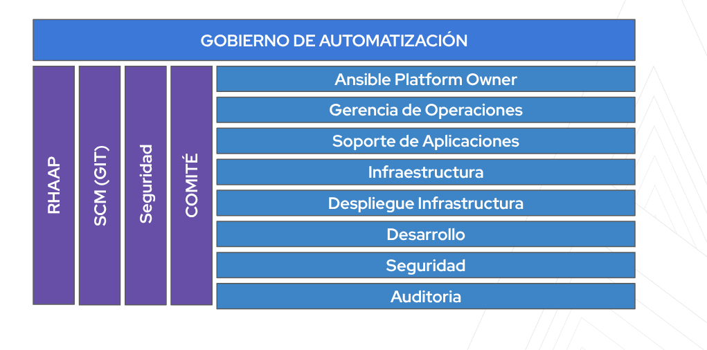
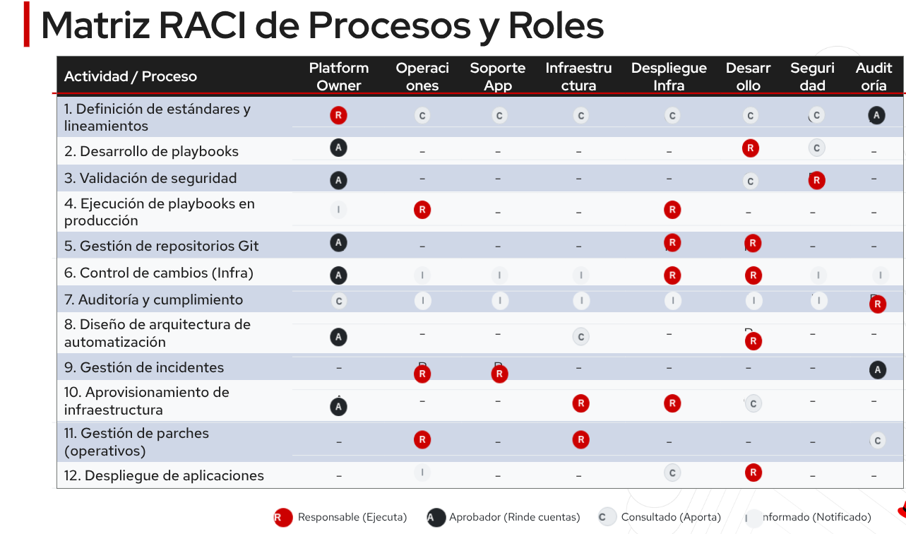

# 3. Roles y responsabilidades

## Estructura organizativa de referencia

Las franjas horizontales representan funciones participantes; las verticales representan capacidades transversales. No constituyen una jerarquía de permisos ni otorgan acceso automático a producción. El comité acuerda políticas y excepciones; cada decisión operativa conserva un responsable final.

| Función de la imagen | Correspondencia en el workshop | Decisión o entrega |
| --- | --- | --- |
| Ansible Platform Owner | AAP Admin y owner designado de plataforma | Servicio de plataforma, RBAC y continuidad |
| Gerencia de Operaciones | Operaciones/SRE y dueño del servicio | Ventana, ejecución, incidentes y entrega |
| Soporte de Aplicaciones | Dominio técnico y consumidor | Verificación funcional y aceptación |
| Infraestructura / Despliegue Infraestructura | Dominio técnico y Operaciones | Diseño del destino y ejecución autorizada |
| Desarrollo | Dev | Playbooks, pruebas y recuperación |
| Seguridad | Seguridad y Compliance | Riesgo, permisos, secretos y controles |
| Auditoría | Revisor de evidencia independiente | Trazabilidad y evaluación de cumplimiento |
| RHAAP / SCM (Git) / Seguridad / Comité | AAP Admin, SCM, Seguridad y foro de gobierno | Controles compartidos y revisión del modelo |

**Actividad (10 minutos del bloque RACI):** nombrar personas y suplentes para cada función. Distinguir el owner del servicio de plataforma de su administrador técnico y acordar cómo se evita que el autor apruebe su propio cambio.

## Roles por ámbito
| Rol | Decide y entrega | Límite |
| --- | --- | --- |
| Dueño del caso de uso | Objetivo, riesgo de negocio, SLA, prioridad y retiro | No administra credenciales por defecto |
| Desarrollo de playbooks | Código, tests, contratos y recuperación | No aprueba su propio cambio alto |
| Seguridad y Compliance | Privilegios, secretos, threat model y evidencia regulatoria | No sustituye aceptación funcional |
| Git y SCM | Repos, owners, reglas de revisión y release | No demuestra que un playbook funciona |
| AAP Admin | Projects, inventories, EE, templates, credentials y RBAC | No decide necesidad de negocio |
| Dominio técnico | Especificación y prueba del destino | No controla todos los dominios |
| Operaciones y SRE | Ejecución, entrega, monitoreo e incidentes | Opera versiones autorizadas |
| Solicitante o consumidor | Solicitud válida y aceptación de resultados | No elige credencial ni inventario arbitrario |

Los dominios son Virtualización, Network, Cloud, Plataformas, Seguridad, Infraestructura y Storage. El dueño se asigna por dominio. El rol de dominio técnico representa a sus especialistas. Seguridad como dominio puede crear automatizaciones, pero su revisión de seguridad debe asignarse a una persona independiente.

## Matriz visual para discusión

La imagen suministrada es una referencia inicial para discutir procesos y roles. Conservarla permite comparar el punto de partida con la matriz operativa de este workshop. Algunas filas, como ejecución en producción, parches y despliegue de aplicaciones, no muestran un A explícito. La matriz validada de abajo completa la responsabilidad final y separa entrega de aceptación.

**Actividad (10 minutos del bloque RACI):** elegir una fila de la imagen, identificar sus R, confirmar quién debe ser A y justificar C e I. Auditoría revisa evidencia; asignarle aprobación operativa requiere una decisión expresa de la organización. Registrar los cambios en `templates/raci-editable.csv` y comprobar exactamente un A y al menos un R por actividad.

## RACI global propuesto
A = responsable final de la decisión. R = responsable de ejecutar la actividad. C = consultado. I = informado. A/R cumple ambos roles. Debe existir exactamente un A y al menos un R por fila. Varias personas pueden ser R si sus entregas están delimitadas.

| Etapa | Dueño | Dev | Seguridad | SCM | AAP Admin | Dominio técnico | Operaciones/SRE | Solicitante |
| --- | --- | --- | --- | --- | --- | --- | --- | --- |
| Definición del caso | A/R | C | C | I | I | C | C | C |
| Diseño técnico | A | R | C | I | C | C | C | I |
| Desarrollo | C | A/R | C | C | I | C | I | I |
| Validación técnica | C | A/R | C | C | I | C | C | I |
| Revisión de seguridad | C | C | A/R | I | C | C | C | I |
| Merge y release | C | R | C | A | I | I | I | I |
| Configuración AAP | C | C | C | I | A/R | C | C | I |
| Pruebas no productivas | A | R | C | I | C | R | C | C |
| Autorización de producción | A/R | C | C | I | C | C | C | I |
| Solicitud y programación | C | I | I | I | C | I | R | A/R |
| Ejecución y recuperación | A | C | C | I | C | C | R | I |
| Entrega de output | A | C | C | I | C | I | R | C |
| Aceptación de output | C | I | I | I | I | C | R | A/R |
| Monitoreo y mejora | A | C | C | I | C | C | R | C |
| Retiro | A | C | C | C | R | C | R | I |

## Cambios respecto a la matriz inicial
Validaciones técnicas tienen Dev como A/R. Operaciones entrega output y monitorea. El consumidor acepta el output en una etapa separada. La autorización de producción, recuperación y retiro tienen responsables explícitos. El change advisory puede ser un aprobador adicional para casos de riesgo alto sin crear un segundo A en el RACI.

## Delegación y conflictos
El A registra su suplente y cobertura. AAP Admin y Operaciones pueden recaer en una persona para el laboratorio. En producción crítica, el autor, aprobador y ejecutor se separan cuando sea posible. Documentar controles compensatorios cuando la dotación no lo permita.

## Ejercicio RACI
Copiar `templates/raci-editable.csv`, sustituir nombres de roles por personas o equipos y acordar evidencias por fila. Ejecutar `python scripts/validate_raci.py templates/raci-editable.csv`. El validador comprueba letras y cobertura, pero no reemplaza la aceptación del comité.

## Salida
RACI aprobado por dueños de dominio y equipo transversal, con suplentes y fecha de revisión.
